# Ansible OpenShift Compliance Automation

Automatización de compliance para OpenShift usando Ansible, el Compliance Operator de OpenShift y GitOps con ACM (Advanced Cluster Management).

## Descripción

Este proyecto automatiza la gestión de compliance en entornos OpenShift multi-cluster mediante:

- **GitOps**: Configuración declarativa de políticas de compliance usando PolicyGenerator de ACM
- **Compliance Operator**: Escaneos automáticos y periódicos de compliance (CIS, PCI-DSS)
- **Exportación de Reportes**: Generación de reportes HTML desde los resultados de compliance
  - Soporta estándares específicos: `ocp4-pci-dss-4-0`, `ocp4-pci-dss-node-4-0-*`, `ocp4-cis-1-7`, `ocp4-cis-node-1-7-*`
- **Controles de Seguridad**: Playbooks especializados para informar y aplicar controles de seguridad
  - **Inform**: Revisión y reporte de controles de seguridad (kubeadmin, logs, ingress, LDAP, ACS, network policies, OAuth, remediaciones)
  - **Enforce**: Aplicación automática de remediaciones y configuración de controles (OAuth timeouts, ComplianceRemediations)
- **Multi-cluster**: Soporte para ejecución en múltiples clusters gestionados desde un Hub
- **Entrega de Reportes**: Push de reportes a GitLab (orquestador y roles Inform/Enforce suben ZIPs y reportes TXT al repositorio)
- **Conexión Hub-to-Spoke**: Los roles de controles de seguridad obtienen el kubeconfig del managed cluster desde el Hub (secret `admin-kubeconfig`) y ejecutan las tareas contra cada spoke
- **100% Agnóstico**: Sin valores hardcodeados, todas las variables se inyectan desde AAP
- **Mejores Prácticas**: Todos los módulos de Ansible utilizan FQDN (Fully Qualified Domain Names) para mayor claridad y compatibilidad

## Estructura del Proyecto

```
.
├── playbooks/                              # Playbooks principales
│   ├── orchestrator_aap_multicluster.yml   # Orquestador multi-cluster para ejecución en AAP
│   ├── enforce.yaml                        # Playbook para aplicar controles de seguridad (enforce)
│   └── inform.yaml                         # Playbook para informar sobre controles de seguridad (inform)
├── roles/                                  # Roles de Ansible
│   ├── gitops_policy_update/               # Actualización de políticas GitOps
│   │   ├── defaults/
│   │   │   └── main.yml                    # Variables por defecto del rol
│   │   └── tasks/
│   │       └── main.yml                    # Tareas de actualización GitOps
│   ├── toggle_policies/                    # Generación de configuraciones (PolicyGenerator, ScanSetting)
│   │   ├── defaults/
│   │   │   └── main.yml                    # Variables por defecto del rol
│   │   ├── tasks/
│   │   │   └── main.yml                    # Tareas de generación de políticas
│   │   └── templates/
│   │       ├── policy-generator-config.yaml.j2  # Template de PolicyGenerator
│   │       └── scan-setting.yaml.j2            # Template de ScanSetting
│   ├── compliance_wait/                    # Espera de instalación del Compliance Operator
│   │   └── tasks/
│   │       └── main.yml                    # Tareas de espera
│   ├── compliance_export_html/             # Exportación de reportes HTML desde PVCs
│   │   ├── defaults/
│   │   │   └── main.yml                    # Variables por defecto del rol
│   │   ├── tasks/
│   │   │   ├── main.yml                    # Tareas principales de exportación
│   │   │   └── process_pvc.yml            # Procesamiento de PVCs
│   │   └── templates/
│   │       ├── extract-kubeconfig.sh.j2   # Script para extraer kubeconfig
│   │       ├── extract-pod.yaml.j2        # Template de Pod para extracción
│   │       ├── render_reports.sh.j2       # Script para renderizar reportes HTML
│   │       └── summary.txt.j2             # Template de resumen
│   ├── controles-seguridad-enforce/        # Aplicación de controles de seguridad (enforce)
│   │   ├── defaults/
│   │   │   └── main.yaml                   # Variables por defecto del rol
│   │   ├── tasks/
│   │   │   ├── main.yml                    # Entrada: iteración sobre target_clusters_list
│   │   │   ├── process_cluster.yml         # Lógica por cluster (Hub-to-Spoke, enforce, reporte)
│   │   │   ├── remediaciones_automaticas_enforce.yaml  # Aplicación de ComplianceRemediations
│   │   │   ├── 071_oauth_timeouts_enforce.yml         # Configuración de timeouts OAuth
│   │   │   └── 99_send_report.yml          # Generación de reporte y push a GitLab
│   │   └── templates/
│   │       └── report_final.j2             # Template de reporte final
│   └── controles-seguridad-inform/         # Información sobre controles de seguridad (inform)
│       ├── defaults/
│       │   └── main.yaml                   # Variables por defecto del rol
│       ├── tasks/
│       │   ├── main.yml                    # Entrada: iteración sobre target_clusters_list
│       │   ├── process_cluster.yml         # Lógica por cluster (Hub-to-Spoke, inform, reporte)
│       │   ├── 01_kubeadmin.yml            # Revisión de kubeadmin
│       │   ├── 02_log_forwarder.yml         # Revisión de log forwarder
│       │   ├── 03_ingress_tls.yml          # Revisión de TLS en ingress
│       │   ├── 04_ldap_tls.yml             # Revisión de TLS en LDAP
│       │   ├── 05_acs_sensor.yml           # Revisión de ACS sensor
│       │   ├── 06_network_policies.yml     # Revisión de network policies
│       │   ├── 07_oauth_timeouts_inform.yml # Revisión de timeouts OAuth
│       │   ├── automatic_remediation_inform.yml  # Información de remediaciones automáticas
│       │   └── 99_send_report.yml          # Generación y envío de reportes
│       └── templates/
│           └── report_final.j2             # Template de reporte final
├── ee-compliance/                          # Execution Environment personalizado
│   ├── execution-environment.yml          # Configuración del EE
│   ├── requirements.yml                   # Dependencias de Ansible (colecciones)
│   ├── bindep.txt                        # Dependencias del sistema (bindep)
│   └── context/                          # Contexto para construir el EE
│       ├── Dockerfile                    # Dockerfile del EE
│       └── _build/                       # Archivos de construcción
│           ├── bindep.txt                # Bindep para construcción
│           ├── requirements.yml          # Requirements para construcción
│           └── scripts/                 # Scripts de construcción
│               ├── assemble              # Script de ensamblado
│               ├── check_ansible         # Verificación de Ansible
│               ├── check_galaxy          # Verificación de Galaxy
│               ├── entrypoint            # Punto de entrada
│               ├── install-from-bindep   # Instalación desde bindep
│               ├── introspect.py         # Script de introspección
│               └── pip_install          # Instalación de pip
├── inventories/                           # Inventarios de Ansible
│   └── localhost.yml                     # Inventario localhost
└── ansible.cfg                            # Configuración de Ansible
```

## Requisitos

### Infraestructura

- **OpenShift Hub Cluster** (ACM Hub) con:
  - Advanced Cluster Management (ACM) instalado y configurado
  - Compliance Operator instalado en el Hub
  - Managed Clusters registrados y en estado `Ready`
  - Acceso desde AAP al Hub Cluster (kubeconfig o Bearer Token)

- **Managed Clusters** con:
  - Compliance Operator instalado en cada cluster
  - Namespace `openshift-compliance` creado
  - PVCs de compliance generados (resultado de escaneos previos)

### Ansible Automation Platform (AAP)

- **AAP 2.x o superior** instalado y operativo
- **Execution Environment** personalizado (ver `ee-compliance/`)
- **Repositorio GitOps** (opcional, solo si `do_gitops=true`)

### Execution Environment Personalizado

El Execution Environment debe incluir las siguientes dependencias:

#### Colecciones de Ansible

- `kubernetes.core` - Para operaciones con Kubernetes/OpenShift
- `ansible.posix` - Para operaciones de sistema POSIX
- `community.general` - Para módulo `archive` (comprimir reportes)

#### Paquetes del Sistema

- `openscap-scanner` - Para generar reportes HTML desde XML de compliance
- `bzip2` - Para descomprimir archivos `.bzip2`
- `zip` - Para comprimir reportes en formato ZIP
- `unzip` - Para descomprimir archivos ZIP
- `git` - Para operaciones GitOps
- `gcc` - Compilador C (requerido para algunas dependencias Python)
- `python3-devel` - Headers de desarrollo de Python
- `libxml2-devel` - Headers de desarrollo de libxml2 (requerido para openscap)
- `libxslt-devel` - Headers de desarrollo de libxslt (requerido para openscap)

#### Herramientas CLI

- `oc` (OpenShift CLI) - Para interactuar con clusters OpenShift
- `tar` - Para operaciones de archivo

**Nota**: Ver `ee-compliance/` para el Dockerfile y configuración completa del Execution Environment.

## Uso Rápido

### Ejecución desde Ansible Automation Platform (AAP)

**Recomendado para producción**. 

1. Configurar Execution Environment
2. Crear credenciales (Hub ACM, GitHub para GitOps, GitLab para reportes)
3. Configurar Job Template con Survey (`survey_target_clusters`; se recomienda **Multiple choice multi-select** para elegir clusters)
4. Ejecutar desde AAP UI

Para la configuración detallada en AAP (variables, credenciales HUB ACM y GitLab, Survey), ver **`playbooks/GUIA_ACTUALIZACION_AAP_GITLAB.md`**.

### Ejecución desde línea de comandos (Desarrollo/Testing)

#### Playbook Orquestador Multi-Cluster

```bash
# Ejecutar solo GitOps (actualizar políticas)
ansible-playbook playbooks/orchestrator_aap_multicluster.yml \
  -e "do_gitops=true" \
  -e "github_user=tu_usuario" \
  -e "github_token=tu_token" \
  -e "gitops_repo_branch=main" \
  -e "survey_target_clusters=cluster-acs,cluster-2"

# Ejecutar solo export HTML (generar reportes)
ansible-playbook playbooks/orchestrator_aap_multicluster.yml \
  -e "do_export_html=true" \
  -e "survey_target_clusters=cluster-acs,cluster-2"

# Ejecutar ambos (GitOps + Export HTML)
ansible-playbook playbooks/orchestrator_aap_multicluster.yml \
  -e "do_gitops=true" \
  -e "do_export_html=true" \
  -e "github_user=tu_usuario" \
  -e "github_token=tu_token" \
  -e "gitops_repo_branch=main" \
  -e "survey_target_clusters=cluster-acs,cluster-2"

# Ejecutar con push de reportes a GitLab
ansible-playbook playbooks/orchestrator_aap_multicluster.yml \
  -e "do_export_html=true" \
  -e "do_push_gitlab=true" \
  -e "survey_target_clusters=cluster-acs,cluster-2" \
  -e "gitlab_repo_url=https://gitlab.com/mi-org/compliance-reports" \
  -e "gitlab_token=tu_token" \
  -e "gitlab_user=ansible-bot" \
  -e "git_workdir=/tmp/compliance-reports-git"
```

Para **Inform** y **Enforce** (multi-cluster, lista de clusters desde Survey o Extra Vars):

```bash
# Inform: revisión de controles en varios clusters (survey_target_clusters: uno por línea o multi-select)
ansible-playbook playbooks/inform.yaml -e "survey_target_clusters=cluster-a\ncluster-b" -e "report_name=ALL"

# Enforce: aplicación de controles en varios clusters
ansible-playbook playbooks/enforce.yaml -e "survey_target_clusters=cluster-a\ncluster-b" -e "enforce_list=ALL"
```

#### Playbook Inform (Revisión de Controles de Seguridad)

Los playbooks `inform.yaml` y `enforce.yaml` usan **`hosts: localhost`** y reciben la lista de clusters por **`survey_target_clusters`** (texto: uno por línea o separados por comas; o multi-select en AAP). Los roles iteran internamente sobre cada cluster (conexión Hub-to-Spoke).

```bash
# Ejecutar todas las revisiones (ALL) en uno o varios clusters
ansible-playbook playbooks/inform.yaml \
  -i inventories/localhost.yml \
  -e "survey_target_clusters=cluster-a\ncluster-b" \
  -e "report_name=ALL"

# Ejecutar revisiones específicas
ansible-playbook playbooks/inform.yaml \
  -i inventories/localhost.yml \
  -e "survey_target_clusters=cluster-a" \
  -e "report_name=kubeadmin,logs,ingress"

# Con push a GitLab (reportes en reportes_controles_seguridad/<cluster>/)
ansible-playbook playbooks/inform.yaml \
  -e "survey_target_clusters=cluster-a" \
  -e "report_name=ALL" \
  -e "gitlab_repo_url=https://gitlab.com/org/repo" \
  -e "gitlab_token=tu_token" \
  -e "gitlab_user=ansible-bot" \
  -e "git_workdir=/tmp/compliance-reports-git"
```

#### Playbook Enforce (Aplicación de Controles de Seguridad)

```bash
# Aplicar todas las remediaciones y controles (ALL) en uno o varios clusters
ansible-playbook playbooks/enforce.yaml \
  -i inventories/localhost.yml \
  -e "survey_target_clusters=cluster-a\ncluster-b" \
  -e "enforce_list=ALL"

# Aplicar solo remediaciones automáticas
ansible-playbook playbooks/enforce.yaml \
  -i inventories/localhost.yml \
  -e "enforce_list=remediaciones_automaticas"

# Aplicar solo configuración de OAuth timeouts
ansible-playbook playbooks/enforce.yaml \
  -i inventories/localhost.yml \
  -e "enforce_list=oauth" \
  -e "oauth_client=ALL"
```

## Diagrama de Flujo

El siguiente diagrama muestra el flujo de ejecución del playbook `orchestrator_aap_multicluster.yml`:

```mermaid
flowchart TD
    Start([Inicio del Playbook]) --> Normalize[Normalizar Credenciales<br/>desde Environment Variables]
    Normalize --> Validate[Validar Variables<br/>Obligatorias]
    Validate --> NormalizeData[Normalizar Lista<br/>de Clusters]
    NormalizeData --> Debug[Mostrar Configuración<br/>Recibida]
    
    Debug --> CheckGitOps{do_gitops<br/>= true?}
    CheckGitOps -->|Sí| GitOps[Fase GitOps<br/>- Clonar Repo<br/>- Actualizar Políticas<br/>- Commit & Push]
    CheckGitOps -->|No| CheckExport
    GitOps --> CheckExport{do_export_html<br/>= true?}
    
    CheckExport -->|Sí| LoopStart[Iniciar Bucle<br/>por Cluster]
    CheckExport -->|No| CheckGitLab
    
    LoopStart --> ForEach[Para cada Cluster:<br/>- Obtener Kubeconfig<br/>- Buscar PVCs<br/>- Extraer Reportes<br/>- Generar HTML<br/>- Comprimir en ZIP]
    ForEach --> NextCluster{Hay más<br/>clusters?}
    NextCluster -->|Sí| ForEach
    NextCluster -->|No| CheckGitLab
    
    CheckGitLab{do_push_gitlab<br/>= true?}
    CheckGitLab -->|Sí| FindZips[Buscar todos los ZIPs<br/>generados]
    CheckGitLab -->|No| Summary
    FindZips --> CloneRepo[Clonar Repo GitLab<br/>con OAuth2]
    CloneRepo --> CopyReports[Copiar Reportes<br/>al Repo]
    CopyReports --> GitCommit[Git Add, Commit<br/>y Push]
    GitCommit --> Summary
    
    Summary[Resumen Final<br/>de Ubicación de Reportes] --> End([Fin del Playbook])
    
    style Start fill:#90EE90
    style End fill:#FFB6C1
    style GitOps fill:#87CEEB
    style ForEach fill:#DDA0DD
    style GitCommit fill:#F0E68C
```



### Descripción de las Fases Healthcheck

1. **Normalización de Credenciales**: Lee credenciales desde Environment Variables de AAP (GitHub, GitLab) y las convierte en variables de Ansible
2. **Validación**: Verifica que todas las variables requeridas estén presentes según los flags activados
3. **Normalización de Datos**: Convierte la lista de clusters (`survey_target_clusters`) en formato estándar
4. **Fase GitOps** (opcional): Actualiza políticas de compliance en el repositorio GitOps
5. **Fase Extracción** (opcional): Por cada cluster, extrae reportes desde PVCs y genera HTML
6. **Push a GitLab** (opcional): Clona el repo GitLab, copia los ZIPs generados, hace commit y push
7. **Resumen Final**: Muestra la ubicación de los reportes generados

## Características Principales

### Playbooks de Controles de Seguridad

El proyecto incluye dos playbooks especializados para la gestión de controles de seguridad:

#### Playbook `inform.yaml`

Ejecuta revisiones y genera reportes sobre el estado de los controles de seguridad sin realizar cambios. Incluye:

- **Kubeadmin**: Verifica la existencia del usuario kubeadmin y si es seguro eliminarlo
- **Log Forwarder**: Revisa la configuración del log forwarder
- **Ingress TLS**: Verifica la configuración TLS en los recursos de ingress
- **LDAP TLS**: Revisa la configuración TLS en la integración LDAP
- **ACS Sensor**: Verifica el estado del sensor de Advanced Cluster Security
- **Network Policies**: Revisa las políticas de red configuradas
- **OAuth Timeouts**: Informa sobre la configuración actual de timeouts OAuth
- **Remediaciones Automáticas**: Lista las ComplianceRemediations detectadas por el Compliance Operator

**Variables principales:**
- `report_name`: Controla qué revisiones ejecutar (`ALL` para todas, o lista separada por comas: `kubeadmin,logs,ingress`)

#### Playbook `enforce.yaml`

Aplica cambios y configura controles de seguridad automáticamente. Incluye:

- **Remediaciones Automáticas**: Aplica ComplianceRemediations del Compliance Operator
- **OAuth Timeouts**: Configura timeouts de OAuth globales y por cliente
  - Timeout global: `10m0s` (accessTokenInactivityTimeout)
  - Timeout por cliente: `600s` (accessTokenInactivityTimeoutSeconds)

**Variables principales:**
- `enforce_list`: Controla qué controles aplicar (`ALL` para todos, o lista: `remediaciones_automaticas,oauth`)
- `remediation_name`: Filtro para remediaciones específicas (default: `ALL`)
- `oauth_client`: Filtro para clientes OAuth específicos (default: `ALL`)

### Multi-Cluster Support

El playbook `orchestrator_aap_multicluster.yml` y los roles de controles de seguridad procesan múltiples clusters en una sola ejecución:

- **Orquestador**: Procesa todos los clusters en `survey_target_clusters` (GitOps, export HTML, push GitLab)
- **Inform/Enforce**: Los roles reciben `target_clusters_list` (derivada de `survey_target_clusters`) e iteran internamente; cada cluster usa conexión Hub-to-Spoke (secret `admin-kubeconfig` en el Hub)
- Genera reportes individuales por cluster y los sube a GitLab

### Entrega de Reportes (GitLab)

- **Orquestador**: Push de ZIPs de compliance al repositorio GitLab (ruta `reports/`)
- **Inform/Enforce**: Push de reportes TXT al repositorio GitLab (ruta `reportes_controles_seguridad/<cluster>/`); se mantienen los 5 archivos más recientes por cluster
- Autenticación OAuth2 con token; no se usa correo electrónico

### Seguridad

- **Sin valores hardcodeados**: Todas las variables sensibles se inyectan desde AAP
- **Validación de inputs**: El playbook valida que todas las variables requeridas estén presentes
- **Credenciales seguras**: Soporte para Source Control Credentials y Environment Variables en AAP
- **Soporte de Environment Variables**: Los playbooks normalizan credenciales desde Environment Variables (GitHub: `GITHUB_TOKEN`, `GITHUB_USER`; GitLab: `GITLAB_TOKEN`, `GITLAB_USER`) inyectadas por Credential Types de AAP

### 100% Agnóstico

- No contiene valores hardcodeados de usuarios, tokens o contraseñas
- Todas las variables se inyectan desde AAP (Extra Vars, Survey, Credentials)
- Fácil de adaptar a diferentes entornos

### Estándares de Compliance Soportados

El rol `compliance_export_html` procesa únicamente los siguientes estándares de compliance:

#### Estándares PCI-DSS
- **`ocp4-pci-dss-4-0`**: Estándar PCI-DSS 4.0 para plataforma
- **`ocp4-pci-dss-node-4-0-*`**: Estándar PCI-DSS 4.0 para nodos (incluye variantes con sufijos como `-master`, `-worker`, etc.)

#### Estándares CIS
- **`ocp4-cis-1-7`**: Estándar CIS 1.7 para plataforma
- **`ocp4-cis-node-1-7-*`**: Estándar CIS 1.7 para nodos (incluye variantes con sufijos como `-master`, `-worker`, etc.)

**Nota**: El filtro utiliza coincidencias exactas para los estándares de plataforma y coincidencias por prefijo para los estándares de nodos, permitiendo capturar automáticamente todas las variantes con sufijos de nodos (ej: `ocp4-cis-node-1-7-master`, `ocp4-cis-node-1-7-worker`, `ocp4-pci-dss-node-4-0-master`, etc.).

Los PVCs que no coincidan con estos estándares serán ignorados durante el procesamiento.

## Roles de Controles de Seguridad

### Rol `controles-seguridad-inform`

Este rol realiza revisiones y auditorías de controles de seguridad sin realizar cambios en el cluster. Genera reportes detallados sobre el estado actual de la configuración.

#### Tareas de Revisión

1. **01_kubeadmin.yml**: Verifica la existencia del usuario kubeadmin y evalúa si es seguro eliminarlo basándose en la presencia de identity providers configurados.

2. **02_log_forwarder.yml**: Revisa la configuración del log forwarder y su estado operativo.

3. **03_ingress_tls.yml**: Verifica la configuración TLS en los recursos de ingress del cluster.

4. **04_ldap_tls.yml**: Revisa la configuración TLS en la integración LDAP/Active Directory.

5. **05_acs_sensor.yml**: Verifica el estado del sensor de Advanced Cluster Security (ACS/StackRox).

6. **06_network_policies.yml**: Revisa las políticas de red configuradas y genera un reporte de cobertura.

7. **07_oauth_timeouts_inform.yml**: Informa sobre la configuración actual de timeouts OAuth (global y por cliente).

8. **automatic_remediation_inform.yml**: Lista todas las ComplianceRemediations detectadas por el Compliance Operator y su estado actual.

9. **99_send_report.yml**: Genera un reporte consolidado (TXT) y lo sube al repositorio GitLab (ruta `reportes_controles_seguridad/<cluster>/`); mantiene los 5 archivos más recientes por cluster.

#### Control de Ejecución

- **Iteración por clusters**: El rol recibe `target_clusters_list` (derivada de `survey_target_clusters` en el playbook) e itera internamente (`main.yml` → `process_cluster.yml` por cada cluster). La conexión a cada cluster es **Hub-to-Spoke** (secret `admin-kubeconfig` en el Hub).
- **Revisiones**: Las tareas se ejecutan condicionalmente según `report_name`:
  - `ALL`: Ejecuta todas las revisiones
  - Lista específica: Ejecuta solo las revisiones especificadas (ej: `kubeadmin,logs,ingress`)

### Rol `controles-seguridad-enforce`

Este rol aplica cambios y configura controles de seguridad automáticamente en el cluster.

#### Tareas de Aplicación

1. **remediaciones_automaticas_enforce.yaml**: 
   - Obtiene todas las ComplianceRemediations del Compliance Operator
   - Aplica las remediaciones configurando `spec.apply: true`
   - Genera un reporte con el estado de aplicación
   - Soporta filtrado por nombre de remediación mediante la variable `remediation_name`

2. **071_oauth_timeouts_enforce.yml**:
   - Configura el timeout global de OAuth a `10m0s` (accessTokenInactivityTimeout)
   - Configura timeouts por cliente OAuth a `600s` (accessTokenInactivityTimeoutSeconds)
   - Genera un respaldo de la configuración original antes de aplicar cambios
   - Soporta filtrado de clientes mediante la variable `oauth_client`

3. **99_send_report.yml**: Genera un reporte consolidado con todas las acciones realizadas y lo sube al repositorio GitLab (ruta `reportes_controles_seguridad/<cluster>/`).

#### Control de Ejecución

- **Iteración por clusters**: Igual que el rol Inform: el rol recibe `target_clusters_list` e itera internamente; conexión Hub-to-Spoke por cluster.
- **Controles**: Las tareas se ejecutan condicionalmente según `enforce_list`:
  - `ALL`: Aplica todos los controles
  - Lista específica: Aplica solo los controles especificados (ej: `remediaciones_automaticas,oauth`)

#### Seguridad y Respaldo

- El rol genera respaldos de la configuración original antes de aplicar cambios
- Los respaldos se incluyen en el reporte final para facilitar la reversión si es necesario
- Las acciones se registran detalladamente en el reporte

## Variables Principales

### Flags de Control

| Variable | Tipo | Descripción | Default |
|----------|------|-------------|---------|
| `do_gitops` | boolean | Activar actualización de políticas GitOps | `false` |
| `do_export_html` | boolean | Activar exportación de reportes HTML | `false` |
| `do_push_gitlab` | boolean | Activar push de reportes al repositorio GitLab | `false` |

### Variables de GitOps (Requeridas si `do_gitops=true`)

| Variable | Tipo | Descripción | Default |
|----------|------|-------------|---------|
| `github_user` | string | Usuario de GitHub | - |
| `github_token` | string | Token de GitHub (🔒 Credential) | - |
| `gitops_repo_branch` | string | Branch del repositorio GitOps | `main` |
| `run_cis` | boolean | Habilitar escaneo CIS | `true` |
| `run_pci` | boolean | Habilitar escaneo PCI-DSS | `false` |
| `scan_remediation_action` | string | Acción de remediación (`inform`, `enforce`) | `inform` |
| `scan_schedule` | string | Schedule cron para escaneos | `"0 1 * * *"` |
| `scan_setting_name` | string | Nombre del ScanSetting | `periodic-daily` |
| `placement_label_key` | string | Key del label para placement | `compliance` |
| `placement_label_value` | string | Valor del label para placement | `enabled` |

### Variables de GitLab (Requeridas si `do_push_gitlab=true` en orquestador)

| Variable | Tipo | Descripción | Default |
|----------|------|-------------|---------|
| `gitlab_repo_url` | string | URL HTTPS del repositorio GitLab | - |
| `gitlab_token` | string | Token de acceso GitLab (🔒 Credential) | - |
| `gitlab_user` | string | Usuario Git para commits | - |
| `git_workdir` | string | Directorio temporal para clonar el repo | `/tmp/compliance-reports-git` |
| `gitlab_repo_branch` | string | Rama del repositorio | `main` |

### Variables de Multi-Cluster

| Variable | Tipo | Descripción | Default |
|----------|------|-------------|---------|
| `survey_target_clusters` | string/list | Lista de clusters a procesar | - |

### Variables de Controles de Seguridad - Inform

| Variable | Tipo | Descripción | Default |
|----------|------|-------------|---------|
| `survey_target_clusters` | string/list | Lista de clusters a procesar (Survey multi-select o texto, uno por línea/comas). Los playbooks la convierten en `target_clusters_list`. | - |
| `report_name` | string | Controles a revisar (`ALL` o lista: `kubeadmin,logs,ingress,ldap,acs,network,oauth,remediation`) | `ALL` |
| `report_dir` | string | Directorio local para guardar reportes | `/tmp/ocp-reports` |
| `system_ns_regex` | string | Expresión regular para filtrar namespaces del sistema en network policies | `^(openshift.*\|kube.*\|default\|stackrox)$` |
| `git_workdir` | string | Directorio temporal para clonar el repo GitLab (push de reportes) | - |
| `gitlab_repo_url` | string | URL HTTPS del repositorio GitLab | - |
| `gitlab_token` | string | Token de acceso GitLab (🔒 Credential) | - |
| `gitlab_user` | string | Usuario Git para commits | - |

**Nota**: Los roles iteran sobre `target_clusters_list` (derivada de `survey_target_clusters`). La conexión a cada cluster es Hub-to-Spoke (secret `admin-kubeconfig` en el Hub). Los reportes se suben a GitLab si están definidos `git_workdir` y `gitlab_repo_url`.

### Variables de Controles de Seguridad - Enforce

| Variable | Tipo | Descripción | Default |
|----------|------|-------------|---------|
| `survey_target_clusters` | string/list | Lista de clusters a procesar (Survey multi-select o texto). Se convierte en `target_clusters_list`. | - |
| `enforce_list` | string | Controles a aplicar (`ALL` o lista: `remediaciones_automaticas,oauth`) | `ALL` |
| `remediation_name` | string | Filtro de remediaciones (`ALL` o lista separada por comas) | `ALL` |
| `oauth_client` | string | Filtro de clientes OAuth (`ALL` o lista separada por comas) | `ALL` |
| `report_dir` | string | Directorio local para guardar reportes | `/tmp/ocp-reports` |
| `git_workdir` | string | Directorio temporal para clonar el repo GitLab | - |
| `gitlab_repo_url` | string | URL HTTPS del repositorio GitLab | - |
| `gitlab_token` | string | Token de acceso GitLab (🔒 Credential) | - |
| `gitlab_user` | string | Usuario Git para commits | - |

**Nota**: Misma lógica de iteración y Hub-to-Spoke que el rol Inform; los reportes se suben a GitLab si están definidas las variables de GitLab.

**🔒 SEGURIDAD**: Las variables marcadas con 🔒 deben configurarse como **Credentials** o **Environment Variables** en AAP (nunca en texto plano).

## Troubleshooting

### Error: "Faltan variables de Git"

**Solución**: Verificar que `github_user`, `github_token` y `gitops_repo_branch` estén definidas cuando `do_gitops=true`.

### Error: "Faltan variables de GitLab"

**Solución**: Verificar que `gitlab_repo_url`, `gitlab_token`, `gitlab_user` y `git_workdir` estén definidas cuando `do_push_gitlab=true` (orquestador) o cuando los roles Inform/Enforce deban subir reportes a GitLab.

### Error: Git push falla (credenciales o rama)

**Síntoma**: La tarea "[REPORT] Añadir archivos, commit y push a GitLab" falla.

**Solución**:
1. Verificar que la credencial de GitLab (token) esté asociada al Job Template y que inyecte `GITLAB_TOKEN` o que `gitlab_token` se pase por Extra Vars/Survey (como secreto).
2. Verificar que la rama (`gitlab_repo_branch` o `main`) exista en el repositorio.
3. Si no hay cambios que commitear, la tarea está preparada para no fallar (mensaje `NO_CHANGES`); si aun así falla, revisar la salida del job (temporalmente `no_log: false` en la tarea para depurar).

### No se encuentran PVCs en los clusters

**Solución**: 
1. Verificar que el Compliance Operator esté instalado
2. Verificar que se hayan ejecutado escaneos previamente
3. Verificar que los PVCs existan en el namespace `openshift-compliance`
4. **Verificar que los PVCs coincidan con los estándares soportados**: El playbook solo procesa PVCs que coincidan con los siguientes estándares:
   - `ocp4-pci-dss-4-0`
   - `ocp4-pci-dss-node-4-0-*` (ej: `ocp4-pci-dss-node-4-0-master`, `ocp4-pci-dss-node-4-0-worker`)
   - `ocp4-cis-1-7`
   - `ocp4-cis-node-1-7-*` (ej: `ocp4-cis-node-1-7-master`, `ocp4-cis-node-1-7-worker`)
   
   Si tus PVCs tienen nombres diferentes, no serán procesados. Verifica los nombres de tus PVCs con:
   ```bash
   oc get pvc -n openshift-compliance
   ```
