# Ansible OpenShift Compliance Automation

Automatización de compliance para OpenShift usando Ansible, el Compliance Operator de OpenShift y GitOps con ACM (Advanced Cluster Management).

## Descripción

Este proyecto automatiza la gestión de compliance en entornos OpenShift multi-cluster mediante:

- **GitOps**: Configuración declarativa de políticas de compliance usando PolicyGenerator de ACM
- **Compliance Operator**: Escaneos automáticos y periódicos de compliance (CIS, PCI-DSS)
- **Exportación de Reportes**: Generación de reportes HTML desde los resultados de compliance
  - Soporta estándares específicos: `ocp4-pci-dss-4-0`, `ocp4-pci-dss-node-4-0-*`, `ocp4-cis-1-7`, `ocp4-cis-node-1-7-*`
- **Multi-cluster**: Soporte para ejecución en múltiples clusters gestionados desde un Hub
- **Envío de Reportes**: Envío consolidado de reportes por correo electrónico (soporta múltiples destinatarios)
- **100% Agnóstico**: Sin valores hardcodeados, todas las variables se inyectan desde AAP

## Estructura del Proyecto

```
.
├── playbooks/                      # Playbooks principales
│   ├── compliance-pipeline.yml              # Playbook principal del pipeline (single cluster)
│   └── orchestrator_aap_multicluster.yml   # Orquestador multi-cluster para ejecución en AAP
├── roles/                          # Roles de Ansible
│   ├── gitops_policy_update        # Actualización de políticas GitOps
│   ├── toggle_policies             # Generación de configuraciones (PolicyGenerator, ScanSetting)
│   ├── compliance_wait             # Espera de instalación del Compliance Operator
│   └── compliance_export_html       # Exportación de reportes HTML desde PVCs
├── ee-compliance/                  # Execution Environment personalizado
│   ├── execution-environment.yml   # Configuración del EE
│   ├── requirements.yml            # Dependencias de Ansible
│   └── context/Dockerfile          # Dockerfile del EE
├── guias-configuración/           # Documentación de configuración
│   ├── GUIA-APROVISIONAMIENTO-AAP.md      # Guía completa de aprovisionamiento en AAP
│   ├── GUIA-CONFIGURACION-COMPLETA-AAP.md  # Guía detallada de configuración
│   ├── CONFIGURACION-EMAIL-AAP.md          # Configuración de correo electrónico
│   ├── CONFIGURACION-GITHUB-TOKEN-AAP.md   # Configuración de token GitHub
│   ├── CONFIGURACION-PLACEMENT-MULTICLUSTER.md  # Configuración de placement
│   ├── CONFIGURACION-SCAN-SETTING.md       # Configuración de escaneos periódicos
│   └── EJEMPLO-EXTRA-VARIABLES-AAP.md      # Ejemplos de variables extra
├── inventories/                   # Inventarios de Ansible
│   └── localhost.yml
└── ansible.cfg                     # Configuración de Ansible
```

## Requisitos

### Infraestructura

- **OpenShift Hub Cluster** (ACM Hub) con:
  - Advanced Cluster Management (ACM) instalado y configurado
  - Compliance Operator instalado en el Hub
  - Managed Clusters registrados y en estado `Ready`
  - Acceso desde AAP al Hub Cluster (kubeconfig o Bearer Token)

- **Managed Clusters** con:
  - Compliance Operator instalado en cada cluster
  - Namespace `openshift-compliance` creado
  - PVCs de compliance generados (resultado de escaneos previos)

### Ansible Automation Platform (AAP)

- **AAP 2.x o superior** instalado y operativo
- **Execution Environment** personalizado (ver `ee-compliance/`)
- **Repositorio GitOps** (opcional, solo si `do_gitops=true`)

### Execution Environment Personalizado

El Execution Environment debe incluir las siguientes dependencias:

#### Colecciones de Ansible

- `kubernetes.core` - Para operaciones con Kubernetes/OpenShift
- `ansible.posix` - Para operaciones de sistema POSIX
- `community.general` - Para módulos `mail` y `archive`

#### Paquetes del Sistema

- `openscap-scanner` - Para generar reportes HTML desde XML de compliance
- `bzip2` - Para descomprimir archivos `.bzip2`
- `zip` - Para comprimir reportes en formato ZIP
- `unzip` - Para descomprimir archivos ZIP
- `git` - Para operaciones GitOps
- `gcc` - Compilador C (requerido para algunas dependencias Python)
- `python3-devel` - Headers de desarrollo de Python
- `libxml2-devel` - Headers de desarrollo de libxml2 (requerido para openscap)
- `libxslt-devel` - Headers de desarrollo de libxslt (requerido para openscap)

#### Herramientas CLI

- `oc` (OpenShift CLI) - Para interactuar con clusters OpenShift
- `tar` - Para operaciones de archivo

**Nota**: Ver `ee-compliance/` para el Dockerfile y configuración completa del Execution Environment.

## Uso Rápido

### Ejecución desde Ansible Automation Platform (AAP)

**Recomendado para producción**. Ver guía completa: [`guias-configuración/GUIA-APROVISIONAMIENTO-AAP.md`](guias-configuración/GUIA-APROVISIONAMIENTO-AAP.md)

1. Configurar Execution Environment
2. Crear credenciales (GitHub, SMTP)
3. Configurar Job Template con Survey
4. Ejecutar desde AAP UI

### Ejecución desde línea de comandos (Desarrollo/Testing)

```bash
# Ejecutar solo GitOps (actualizar políticas)
ansible-playbook playbooks/orchestrator_aap_multicluster.yml \
  -e "do_gitops=true" \
  -e "github_user=tu_usuario" \
  -e "github_token=tu_token" \
  -e "gitops_repo_branch=main" \
  -e "survey_target_clusters=cluster-acs,cluster-2"

# Ejecutar solo export HTML (generar reportes)
ansible-playbook playbooks/orchestrator_aap_multicluster.yml \
  -e "do_export_html=true" \
  -e "survey_target_clusters=cluster-acs,cluster-2"

# Ejecutar ambos (GitOps + Export HTML)
ansible-playbook playbooks/orchestrator_aap_multicluster.yml \
  -e "do_gitops=true" \
  -e "do_export_html=true" \
  -e "github_user=tu_usuario" \
  -e "github_token=tu_token" \
  -e "gitops_repo_branch=main" \
  -e "survey_target_clusters=cluster-acs,cluster-2"

# Ejecutar con envío por correo consolidado
ansible-playbook playbooks/orchestrator_aap_multicluster.yml \
  -e "do_export_html=true" \
  -e "do_send_email=true" \
  -e "survey_target_clusters=cluster-acs,cluster-2" \
  -e "email_smtp_host=smtp.gmail.com" \
  -e "email_smtp_port=587" \
  -e "email_smtp_username=tu_email@gmail.com" \
  -e "email_smtp_password=tu_app_password" \
  -e "email_to=destinatario1@empresa.com,destinatario2@empresa.com" \
  -e "email_from=compliance@empresa.com" \
  -e "email_subject_prefix=Reporte de compliance multicluster"
```

## Diagrama de Flujo

El siguiente diagrama muestra el flujo de ejecución del playbook `orchestrator_aap_multicluster.yml`:

```mermaid
flowchart TD
    Start([Inicio del Playbook]) --> Normalize[Normalizar Credenciales<br/>desde Environment Variables]
    Normalize --> Validate[Validar Variables<br/>Obligatorias]
    Validate --> NormalizeData[Normalizar Lista<br/>de Clusters]
    NormalizeData --> Debug[Mostrar Configuración<br/>Recibida]
    
    Debug --> CheckGitOps{do_gitops<br/>= true?}
    CheckGitOps -->|Sí| GitOps[Fase GitOps<br/>- Clonar Repo<br/>- Actualizar Políticas<br/>- Commit & Push]
    CheckGitOps -->|No| CheckExport
    GitOps --> CheckExport{do_export_html<br/>= true?}
    
    CheckExport -->|Sí| LoopStart[Iniciar Bucle<br/>por Cluster]
    CheckExport -->|No| CheckEmail
    
    LoopStart --> ForEach[Para cada Cluster:<br/>- Obtener Kubeconfig<br/>- Buscar PVCs<br/>- Extraer Reportes<br/>- Generar HTML<br/>- Comprimir en ZIP]
    ForEach --> NextCluster{Hay más<br/>clusters?}
    NextCluster -->|Sí| ForEach
    NextCluster -->|No| CheckEmail
    
    CheckEmail{do_send_email<br/>= true?}
    CheckEmail -->|Sí| FindZips[Buscar todos los ZIPs<br/>generados]
    CheckEmail -->|No| Summary
    FindZips --> BuildList[Construir Lista<br/>de Clusters Procesados]
    BuildList --> NormalizeEmail[Normalizar Lista<br/>de Destinatarios]
    NormalizeEmail --> SendEmail[Enviar Correo Consolidado<br/>con todos los ZIPs]
    SendEmail --> VerifyEmail[Verificar Resultado<br/>del Envío]
    VerifyEmail --> Summary
    
    Summary[Resumen Final<br/>de Ubicación de Reportes] --> End([Fin del Playbook])
    
    style Start fill:#90EE90
    style End fill:#FFB6C1
    style GitOps fill:#87CEEB
    style ForEach fill:#DDA0DD
    style SendEmail fill:#F0E68C
```



### Descripción de las Fases

1. **Normalización de Credenciales**: Lee credenciales desde Environment Variables de AAP y las convierte en variables de Ansible
2. **Validación**: Verifica que todas las variables requeridas estén presentes según los flags activados
3. **Normalización de Datos**: Convierte la lista de clusters en formato estándar
4. **Fase GitOps** (opcional): Actualiza políticas de compliance en el repositorio GitOps
5. **Fase Extracción** (opcional): Por cada cluster, extrae reportes desde PVCs y genera HTML
6. **Envío Consolidado** (opcional): Envía un solo correo con todos los reportes de todos los clusters
7. **Resumen Final**: Muestra la ubicación de los reportes generados

## Características Principales

### 🎯 Multi-Cluster Support

El playbook `orchestrator_aap_multicluster.yml` procesa múltiples clusters en una sola ejecución:

- Procesa todos los clusters especificados en `survey_target_clusters`
- Genera reportes individuales por cluster
- Envía un correo consolidado con todos los reportes al final

### 📧 Envío Consolidado de Correos

- **Un solo correo** con todos los reportes de todos los clusters procesados
- Soporta **múltiples destinatarios** (separados por comas)
- Archivos comprimidos en ZIP para reducir tamaño
- Timeout configurable para archivos grandes (`email_smtp_timeout`)

### 🔒 Seguridad

- **Sin valores hardcodeados**: Todas las variables sensibles se inyectan desde AAP
- **Validación de inputs**: El playbook valida que todas las variables requeridas estén presentes
- **Credenciales seguras**: Soporte para Source Control Credentials y Environment Variables en AAP

### 🚀 100% Agnóstico

- No contiene valores hardcodeados de usuarios, tokens o contraseñas
- Todas las variables se inyectan desde AAP (Extra Vars, Survey, Credentials)
- Fácil de adaptar a diferentes entornos

### 📋 Estándares de Compliance Soportados

El rol `compliance_export_html` procesa únicamente los siguientes estándares de compliance:

#### Estándares PCI-DSS
- **`ocp4-pci-dss-4-0`**: Estándar PCI-DSS 4.0 para plataforma
- **`ocp4-pci-dss-node-4-0-*`**: Estándar PCI-DSS 4.0 para nodos (incluye variantes con sufijos como `-master`, `-worker`, etc.)

#### Estándares CIS
- **`ocp4-cis-1-7`**: Estándar CIS 1.7 para plataforma
- **`ocp4-cis-node-1-7-*`**: Estándar CIS 1.7 para nodos (incluye variantes con sufijos como `-master`, `-worker`, etc.)

**Nota**: El filtro utiliza coincidencias exactas para los estándares de plataforma y coincidencias por prefijo para los estándares de nodos, permitiendo capturar automáticamente todas las variantes con sufijos de nodos (ej: `ocp4-cis-node-1-7-master`, `ocp4-cis-node-1-7-worker`, `ocp4-pci-dss-node-4-0-master`, etc.).

Los PVCs que no coincidan con estos estándares serán ignorados durante el procesamiento.

## Documentación

### Guías Principales

- **[GUIA-APROVISIONAMIENTO-AAP.md](guias-configuración/GUIA-APROVISIONAMIENTO-AAP.md)**: Guía completa paso a paso para aprovisionar el playbook en AAP desde cero
- **[GUIA-CONFIGURACION-COMPLETA-AAP.md](guias-configuración/GUIA-CONFIGURACION-COMPLETA-AAP.md)**: Guía detallada de configuración de AAP

### Guías Específicas

- **[CONFIGURACION-EMAIL-AAP.md](guias-configuración/CONFIGURACION-EMAIL-AAP.md)**: Configuración de envío de correo electrónico
- **[CONFIGURACION-GITHUB-TOKEN-AAP.md](guias-configuración/CONFIGURACION-GITHUB-TOKEN-AAP.md)**: Configuración de token GitHub
- **[CONFIGURACION-PLACEMENT-MULTICLUSTER.md](guias-configuración/CONFIGURACION-PLACEMENT-MULTICLUSTER.md)**: Configuración de placement para multi-cluster
- **[CONFIGURACION-SCAN-SETTING.md](guias-configuración/CONFIGURACION-SCAN-SETTING.md)**: Configuración de escaneos periódicos
- **[EJEMPLO-EXTRA-VARIABLES-AAP.md](guias-configuración/EJEMPLO-EXTRA-VARIABLES-AAP.md)**: Ejemplos de variables extra para AAP
- **[MIGRACION-CREDENCIALES-EXTRA-VARS.md](guias-configuración/MIGRACION-CREDENCIALES-EXTRA-VARS.md)**: Guía para migrar credenciales de Extra Vars a configuración segura

## Variables Principales

### Flags de Control

| Variable | Tipo | Descripción | Default |
|----------|------|-------------|---------|
| `do_gitops` | boolean | Activar actualización de políticas GitOps | `false` |
| `do_export_html` | boolean | Activar exportación de reportes HTML | `false` |
| `do_send_email` | boolean | Activar envío de reportes por correo | `false` |

### Variables de GitOps (Requeridas si `do_gitops=true`)

| Variable | Tipo | Descripción | Default |
|----------|------|-------------|---------|
| `github_user` | string | Usuario de GitHub | - |
| `github_token` | string | Token de GitHub (🔒 Credential) | - |
| `gitops_repo_branch` | string | Branch del repositorio GitOps | `main` |
| `run_cis` | boolean | Habilitar escaneo CIS | `true` |
| `run_pci` | boolean | Habilitar escaneo PCI-DSS | `false` |
| `scan_remediation_action` | string | Acción de remediación (`inform`, `enforce`) | `inform` |
| `scan_schedule` | string | Schedule cron para escaneos | `"0 1 * * *"` |
| `scan_setting_name` | string | Nombre del ScanSetting | `periodic-daily` |
| `placement_label_key` | string | Key del label para placement | `compliance` |
| `placement_label_value` | string | Valor del label para placement | `enabled` |

### Variables de Correo (Requeridas si `do_send_email=true`)

| Variable | Tipo | Descripción | Default |
|----------|------|-------------|---------|
| `email_smtp_host` | string | Servidor SMTP | - |
| `email_smtp_port` | integer | Puerto SMTP | `587` |
| `email_smtp_username` | string | Usuario SMTP | - |
| `email_smtp_password` | string | Contraseña SMTP (🔒 Credential) | - |
| `email_to` | string/list | Destinatario(s) (separados por comas) | - |
| `email_from` | string | Remitente | - |
| `email_subject_prefix` | string | Prefijo del asunto | - |
| `email_smtp_timeout` | integer | Timeout SMTP en segundos | `60` |

### Variables de Multi-Cluster

| Variable | Tipo | Descripción | Default |
|----------|------|-------------|---------|
| `survey_target_clusters` | string/list | Lista de clusters a procesar | - |

**🔒 SEGURIDAD**: Las variables marcadas con 🔒 deben configurarse como **Credentials** o **Environment Variables** en AAP (nunca en texto plano).

## Troubleshooting

### Error: "Faltan variables de Git"

**Solución**: Verificar que `github_user`, `github_token` y `gitops_repo_branch` estén definidas cuando `do_gitops=true`.

### Error: "Faltan variables de Correo"

**Solución**: Verificar que todas las variables de correo estén definidas cuando `do_send_email=true`.

### Timeout al enviar correo (pero el correo se envía)

**Síntoma**: `TimeoutError: The read operation timed out`

**Solución**: Aumentar `email_smtp_timeout` a 90 o 120 segundos para archivos grandes.

### No se encuentran PVCs en los clusters

**Solución**: 
1. Verificar que el Compliance Operator esté instalado
2. Verificar que se hayan ejecutado escaneos previamente
3. Verificar que los PVCs existan en el namespace `openshift-compliance`
4. **Verificar que los PVCs coincidan con los estándares soportados**: El playbook solo procesa PVCs que coincidan con los siguientes estándares:
   - `ocp4-pci-dss-4-0`
   - `ocp4-pci-dss-node-4-0-*` (ej: `ocp4-pci-dss-node-4-0-master`, `ocp4-pci-dss-node-4-0-worker`)
   - `ocp4-cis-1-7`
   - `ocp4-cis-node-1-7-*` (ej: `ocp4-cis-node-1-7-master`, `ocp4-cis-node-1-7-worker`)
   
   Si tus PVCs tienen nombres diferentes, no serán procesados. Verifica los nombres de tus PVCs con:
   ```bash
   oc get pvc -n openshift-compliance
   ```

Para más detalles, consultar la sección [Troubleshooting](guias-configuración/GUIA-APROVISIONAMIENTO-AAP.md#troubleshooting) en la guía de aprovisionamiento.

## Licencia

Apache License 2.0
